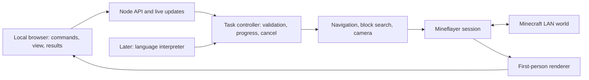

> September 12 update: the live block map and rule-based Survive starter are implemented. See README.md for current capabilities and limits; this document contains the earlier planning history.

> Implementation update: the local web app, pathfinding, nearby block search, saved places,
> and cancellation are implemented. Screenshots are deferred at your request. The app uses
> explicit command patterns, Express, and browser-native server-sent events; free-form AI
> interpretation remains a later extension. See README.md for current usage.

# Minecraft companion agent — proposed project

Planning only. No new feature packages or application skeleton have been installed or built.
The existing demo remains the starting point; its scripts now have explanatory comments.

## Outcome and scope

One bot joins your local Java 1.21.1 world. A local browser UI lets you request a picture
of its view, send it to coordinates or saved places, and locate blocks for you to mine.
Assumption: finding blocks should report locations first. Having the bot break or collect
them is a separate optional command, not a side effect of searching or walking.

Start with explicit commands and buttons. Add ordinary conversational requests after the
underlying actions are reliable. No language model or API key is needed for the first version.

## How the current scripts fit together

`Start Bot.command` opens in Terminal, changes to this project, and launches `start.cjs`.
The helper finds the LAN port, checks the server, and writes `config.json`. It then loads
`bot.cjs`, which connects through Mineflayer and routes Terminal commands to movement calls.
`stop()` cancels timers and invalidates unfinished turns; server events handle lifecycle changes.
The bot behavior originated in the supplied tutorial. The start helper and launcher setup were
added for this Mac. These will be separated into reusable modules as the project grows.

## Proposed architecture



Keep one long-lived bot connection owned by the backend. Refreshing the UI must not create
another player. The browser displays state; the backend owns actions and their results.
Serve the UI/API locally, restrict control connections to the expected origin, and keep
credentials in the backend. Verify that the viewer also listens only locally or is served
through the local application server.

Proposed files (not created yet):

```text
src/
  server.cjs                # HTTP routes, WebSocket events, local app startup
  bot/session.cjs           # Connect, spawn, disconnect, current bot state
  bot/navigation.cjs        # Reach coordinates or a saved waypoint
  bot/blocks.cjs            # Search, describe, and recheck block results
  bot/camera.cjs            # Viewer lifecycle and screenshot requests
  bot/mining.cjs            # Optional later: explicit break/collect action
  tasks/controller.cjs      # One movement task, cancellation, timeout, progress
  commands/schema.cjs       # Allowed commands and validated parameters
  commands/parser.cjs       # Small command vocabulary initially
  commands/interpreter.cjs  # Later: natural language to validated commands
  storage/waypoints.cjs     # Names mapped to world/dimension/coordinates
public/
  index.html                # Command input, controls, results, camera panel
  app.js
  styles.css
data/                       # Local waypoints and screenshot metadata
test/                       # Task tests plus live-world verification scripts
```

Plain HTML/CSS/JavaScript is sufficient for this first UI. Keep CommonJS initially so the
refactor is easy to follow. A frontend framework or TypeScript can be added if complexity warrants it.

## Commands and behavior

| Request | Initial behavior | Completion means |
| --- | --- | --- |
| `screenshot` | Capture a fresh first-person rendered frame | UI shows image, capture time, coordinates, and camera direction |
| `goto 20 64 -10` | Walk near that coordinate using a path | Bot is within the chosen arrival tolerance |
| `goto base` | Resolve a saved waypoint, then navigate | Same arrival check; unknown names ask for coordinates |
| `find oak_log 32` | Search known nearby blocks within 32 blocks | List names, coordinates, distance, dimension, and observation time |
| `stop` | Cancel the active task and release movement | Task becomes cancelled and does not restart itself |
| `mine x y z` (later) | Recheck and break only the requested target | Observe block removal; collection is reported separately |

API proposal: `POST /api/commands` accepts a validated command and returns a task ID;
`GET /api/state` restores the UI after refresh; a WebSocket streams position, connection,
task progress, results, and image availability. Each event includes a task ID and timestamp.
The screenshot request uses the same command channel and returns an image reference.

Allow one action that controls movement at a time. A new movement command cancels the old
one; Stop bypasses the queue. Status and screenshots can run alongside movement, recording
the pose associated with the frame. Use explicit states: idle, running, succeeded, failed,
cancelled. Disconnect/death cancels tasks; reconnecting does not replay old instructions.
Bound search radius, execution time, retries, and result count. Late callbacks must not revive
cancelled work, extending the generation-counter idea in the current script.

## Navigation and block search

Use `mineflayer-pathfinder` for goal-based routing. Initially configure travel to avoid
digging and placing blocks, limit drops, and report unreachable targets or timeouts. Add
saved waypoints before trying vague destinations such as “the mountain.” The plugin supports
goals and configurable movement; our application must still decide acceptable behavior.
[Pathfinder documentation](https://github.com/PrismarineJS/mineflayer-pathfinder).

Mineflayer already exposes block queries and digging APIs. Search the bot's loaded world
data rather than classify pixels. Loaded data is not the entire world, and can include
blocks hidden behind surfaces. Label that distinction in results; optionally add a visible-only
filter. “No matches nearby” must not mean “none exist anywhere.” Recheck results before acting,
because blocks may change. Let the user copy coordinates or send the bot near a selected result.
Long-range exploration needs a separate bounded search strategy that visits new areas.
[Mineflayer API](https://github.com/PrismarineJS/mineflayer/blob/master/docs/api.md).

For optional bot mining, check reachability, tools, game mode, and the current block type.
Breaking a block and obtaining an item are different outcomes, especially in Creative.
`mineflayer-collectblock` is a later convenience for collection workflows.
[Collectblock documentation](https://github.com/PrismarineJS/mineflayer-collectblock).

## Screenshots: first technical experiment

Mineflayer does not provide a rendered game window. Use `prismarine-viewer` to reconstruct
the received world from the bot's first-person perspective. Its documentation lists 1.21.1
and first-person viewing. This is the bot's rendered view, not an exact screenshot of the
official Minecraft client; effects and visual fidelity can differ.
[Viewer documentation](https://github.com/PrismarineJS/prismarine-viewer).

First prove that this Mac can render the actual world, follow the bot's yaw/pitch, and export
a nonblank PNG after chunks/textures load. The proposed capture path is a same-origin browser
canvas captured immediately after rendering. This requires a small integration experiment,
not just a Mineflayer screenshot call. Keep the UI open for the initial version; captures with
the UI closed would need a separate renderer/browser process. Only investigate that extra
dependency if unattended screenshots become necessary. Test dependency installation and
rendering compatibility before investing in the complete camera UI.

## Packages to add when implementation starts

| Package | Purpose | Timing |
| --- | --- | --- |
| `mineflayer` | Existing connection and world APIs | Already installed, keep the working pin |
| `mineflayer-pathfinder` | Coordinate navigation | First navigation milestone |
| `prismarine-viewer` | First-person world rendering | Early compatibility experiment |
| `express` | Serve local UI and command API | UI milestone |
| `ws` | Stream backend updates; browser uses native WebSocket | UI milestone |
| `zod` | Validate structured command inputs | Task controller milestone |
| `mineflayer-collectblock` | Optional automatic block collection | Later, only if requested |

UI package references: [Express](https://expressjs.com/), [ws](https://github.com/websockets/ws),
[Zod](https://zod.dev/). These are proposed choices, not a compatibility-tested bundle.
When building, check current package engines/dependencies against the installed Node and
Mineflayer versions, install incrementally, and pin versions that pass the live checks.
If code imports `minecraft-protocol` or `vec3` directly, declare those direct dependencies
instead of relying on Mineflayer's transitive installation. The existing start helper currently
imports the former transitively; clean that up during the refactor.

Do not download packages just for this planning step. No database, Docker, or hosted service
is needed for the local prototype. Keep waypoints in a small JSON file initially.

## Build order and effort

These are engineering estimates for one developer, assuming a working LAN connection.
They are not a promise of elapsed chat time; game testing and compatibility issues affect them.

1. **Prove the current connection and rendering (half to one day).** Live join, movement,
   stopping, renderer view, and PNG export. If rendering fails, resolve that before the UI expands.
2. **Extract the session/task controller and build the local UI (one to two days).** Connect,
   status, command input, always-visible Stop, errors, screenshot result cards. Refresh without
   duplicating the bot; cancel during pending work.
3. **Navigation and block results (one to two days).** Coordinates, saved places, nearby search,
   results list. Test a wall detour, unreachable destination, missing block, changed block,
   cancellation, and disconnection. Place known test blocks in the Superflat playground.
4. **Integration and usability (one to two days).** Clear failure messages, stale-result handling,
   one-command startup, and repeated live verification.
5. **Natural-language layer (later, roughly two to five additional days for a bounded version).**
   Interpret “show me what you see” or “find nearby oak logs” into the same validated commands.
   Ask about ambiguous places. Keep all execution in the tested action modules; a model should
   not emit arbitrary code. Report actual task outcomes, not assumed success. Choose a model
   provider and its credentials/cost arrangement at that stage.

Expect roughly **four to seven working days for a useful local prototype**, and **two to four
weeks total for a more reliable conversational version**, allowing for rendering and real-world
edge cases. UI and nearby search are low-to-medium difficulty; dependable pathfinding is medium;
camera integration and open-ended exploration are the main uncertainties. Autonomous survival,
mining distant resources, crafting, and recovery from arbitrary terrain are a larger project.

First complete milestone: from the UI, request a fresh view, navigate around one obstacle,
locate known placed blocks, and stop reliably. Then add free-form conversation.
