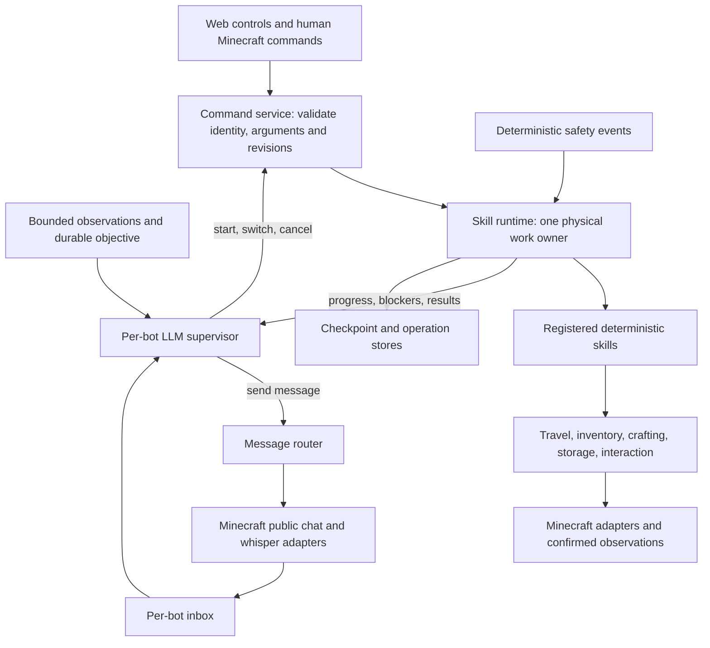

# Proposed foundation for autonomous Minecraft agents

Status: design baseline, September 14, 2026. The foundation, shadow controller, and bounded autonomous controller are now implemented; see [the current runtime guide](AGENT-RUNTIME.md). Live-world pilot outcomes remain to be measured. Companion: [source review and verified findings](AGENT-ARCHITECTURE-REVIEW.md). The sketches below retain the design vocabulary; use the runtime guide and source contracts for the exact shipped API.

## Intended behavior

Every bot has one supervisor configured with a larger model. It knows that bot's objective, capabilities, current work, recent observations, and pending messages. It can select or switch a skill, respond through public chat or whisper, request help from another bot, or wait for a meaningful event.

Skills remain deterministic Minecraft workflows. They handle movement, block interactions, inventory, recovery, and their own bounded local decisions. They do not need their own LLM. A productive farmer can run for many minutes without another supervisor request.

For example, Forge's supervisor receives “Make eight glass.” It starts a validated smelting invocation. When the skill reports `MISSING_INPUT` for sand, the supervisor can whisper a supply request to another bot. Forge can receive the reply while its skill is waiting. Confirmed sand availability can wake the same objective. Collecting old iron output remains a separate effect and cannot satisfy the glass order.

## Architecture



This structure exists per bot. The fleet host shares only deliberate services: the peer directory, transport infrastructure, storage backend, cost ledger, and request scheduler. An optional storage coordinator is a capability assigned to a profile, rather than a special username.

Keep one Node process initially. Asynchronous model requests do not themselves require separate processes. First establish per-bot object ownership and serializable messages. If measurements later show event-loop starvation or unacceptable shared-process failures, the same interface can move behind a worker/process transport. Physical exchanges currently use live peer objects and must be adapted before that move.

## Contracts to establish

### 1. Agent profile: identity is separate from assignment

Resolve and validate profiles once at startup. Pass the resolved profile into `Agent`; do not look up defaults independently inside chat or skill code.

```ts
type AgentProfile = {
  id: string;
  username: string;
  defaultInvocation: { skillId: string; args: Record<string, unknown> };
  preferredProfession: string;
  allowedSkills: string[];
  capabilities: string[];
  supervisor: { model: string; enabled: boolean };
  conversation?: { model: string };
};
```

The server separately resolves credentials and filesystem locations. Runtime state stores the active assignment; it does not mutate the profile. Working reserves combine baseline survival supplies, the active skill's requirements, and supplies needed to reconcile unfinished operations. Switching jobs must not accidentally donate those reserved items.

Bare Start resolves the last valid invocation or the profile default. A bare Terraformer start may correctly report that it needs an area when no saved job exists; choosing the right default does not invent missing parameters.

### 2. Skill definition: one source for execution and discovery

Extend the existing registry. Keep stable internal IDs, compatibility aliases for current commands, and explicit versions for persisted data.

```ts
type SkillDefinition = {
  id: string;
  version: number;
  label: string;
  description: string;
  aliases: string[];
  parameters: JsonSchema;
  result: JsonSchema;
  execution: 'finite' | 'continuous';
  capabilities: string[];
  effects: string[];
  handoff: 'checkpoint' | 'cancel-only';
  resume: 'none' | 'validated-checkpoint';
  availability(context: ReadonlyContext, args: unknown): Availability;
  reserves(context: ReadonlyContext, args: unknown): ItemCounts;
  run(context: SkillContext, args: unknown): Promise<SkillResult>;
};
```

Generate skill menus, command help, API metadata, and supervisor tool descriptions from this definition. Runtime validation remains authoritative. A descriptor saying “does not dig” is documentation until the actual capability/policy boundary enforces it; it is not a sandbox for arbitrary code.

Maintain a distinction between orchestration operations (`start`, `switch`, `stop`, messaging), read-only queries, and executable skills. Expose navigation and existing one-shot mining/farming through the common runner too; they currently bypass portions of the registry.

Expose finite units where they serve planning: obtain a bounded quantity, tend a patch once, smelt a batch, or level a defined area. Keep continuous production as an explicit mode with progress events and checkpoint opportunities. Adding a quantity field requires the skill to enforce and verify it; metadata alone does not make an endless producer finite.

### 3. Command service: all input sources reach the same runtime

Public chat removes addressing; whisper records the recipient; web requests select the target bot. Each adapter translates supported text or structured input into the same invocation. The LLM supplies structured decisions directly and never calls a parser by emitting prose that resembles a chat command.

```ts
type Invocation = {
  requestId: string;
  kind: 'start' | 'switch';
  skillId: string;
  args: Record<string, unknown>;
};

type RequestContext = {
  source: 'human' | 'supervisor' | 'peer';
  actorId: string;
  connectionId: string;
  objectiveRevision: number;
  expectedRunId: string | null;
};
```

Adapters/runtime supply provenance and revisions; the model cannot grant itself human authority or forge a fresh connection identity. Validate argument shape, registered skill, allowed capabilities, live preconditions, world/dimension, and relevant revisions before accepting the invocation, then revalidate after a pending handoff.

Return a receipt with `requestId`, acceptance/rejection, and `runId`. Expose completion separately through a run result/event. “Accepted” must not mean “finished.” A duplicate request ID returns its previous disposition; it cannot launch the same work twice.

Peer messages propose assignments. The receiving supervisor decides whether to accept them according to its objective and current human instructions. Receipt of another bot's chat text never directly grants physical control.

### 4. Skill runtime: one owner, explicit handoff

Extract the current `activeWork`, cancellation, pending-switch, and settlement rules behind a runtime. Retain connection/task fencing and hung-socket isolation. Initially use adapters around existing classes to keep their physical algorithms intact.

The runtime owns run IDs, status transitions, timers, cleanup registration, result publication, and replacement admission. Skills report progress and outcomes; they cannot replace `agent.state.task` or another bot's active owner. A child capability shares its parent's run identity, signal, budgets, and resource ownership.

Provide separate operations:

| Operation | Required semantics |
| --- | --- |
| Start | Acquire ownership once; reject conflicting work or explicitly queue according to policy. |
| Switch | Validate the proposed replacement; request a cooperative yield; reach a declared handoff point; persist checkpoint/uncertain work; drain cleanup; revalidate; start the replacement. |
| Stop | Cancel pending autonomous admission and model decisions, abort physical work immediately, retain ownership through settlement, and suspend autonomous restarting. |
| Resume | Revalidate a declared checkpoint and the live world. Otherwise report that restart/new input is required. |

For a tree skill, a useful ordinary handoff might mean standing safely after a descent and recording remaining supports. For a furnace, it means durable ownership of every submitted transfer, even if cooking continues without the player. For a chest, it means a confirmed/reconciliable operation and a closed window. For walking, cancellation and settlement may be sufficient.

A cooperative yield has a finite deadline. If it cannot establish the advertised boundary, report `HANDOFF_BLOCKED` and keep the replacement pending or rejected according to explicit policy; do not silently escalate an ordinary model switch into unsafe abandonment. Emergency Stop retains its immediate semantics. A disconnected or unresolved socket cannot be reused for replacement work.

Safety reactions are event producers with explicit priority. They use the same physical ownership mechanism, so eating, surfacing, and movement cannot compete with a skill's inventory or path operations. The larger model is never required to acknowledge drowning or an action timeout before the runtime reacts.

### 5. Context, progress, and results: make effects machine-readable

```ts
type SkillContext = {
  runId: string;
  signal: AbortSignal;
  handoffSignal: AbortSignal;
  deadlineAt: number | null;
  observe(): ReadonlyObservation;
  actions: BoundedCapabilities;
  report(progress: SkillProgress): void;
  checkpoint(value: VersionedCheckpoint): Promise<void>;
  registerCleanup(cleanup: () => Promise<void>): void;
};

type SkillResult = {
  runId: string;
  skillId: string;
  outcome: 'succeeded' | 'partial' | 'blocked' | 'cancelled' | 'failed';
  reasonCode?: string;
  confirmedEffects: ConfirmedEffect[];
  outstandingOperationIds: string[];
  checkpointId?: string;
  retry?: { afterMs?: number; requires?: string[] };
};
```

Effects identify the item/block, quantity, location, and associated job/operation where relevant. Mining a block, collecting its drops, producing an item, and delivering that item are different effects. Uncertain side effects are referenced as outstanding operations and must not appear in confirmed counts.

Progress has a shared envelope (`runId`, phase, decision, counts, blocker, next retry, checkpoint readiness), with optional schema-validated skill details. The web state and LLM observation are separate bounded projections of it. Retain existing UI fields temporarily through compatibility projections while migrating cards.

Use reason codes such as `MISSING_INPUT`, `INVENTORY_FULL`, `NO_ROUTE`, `AIR_RECOVERY`, `STALE_SESSION`, and `REQUIRES_RECONCILIATION`. Distinguish a temporary progress blocker from a terminal outcome. Preserve cancellation reasons such as human stop, reassignment, disconnect, and deadline; a supervisor should not infer them from prose.

`handoffSignal` requests cooperative yield without aborting the physical-action signal. A checkpoint-capable skill checks it at bounded intervals, reaches its declared boundary, saves the checkpoint, and returns `cancelled` with reason `HANDOFF` and that checkpoint ID. The runtime still awaits cleanup before replacement. Legacy adapters remain `cancel-only` until their workflow actually implements this behavior; they must not advertise safe checkpoint switching prematurely.

### 6. Durable stores: recovery does not depend on conversation memory

Use a common versioned store API for objectives and skill checkpoints, while retaining specialized transactional storage where it already exists. Scope records by stable bot ID, world identity, dimension, skill version, and job ID. Keep current world-label behavior compatible, documenting that labels are user-selected identities for saves.

Separate four kinds of data:

- Fresh observations, with observation time and scope.
- Durable objective and checkpoint state.
- Operation intent, confirmation, and uncertain/reconciled state for external effects.
- Bounded conversation history and summaries.

Validate loads, atomically save updates, and preserve malformed records for diagnosis rather than silently treating recovery-critical data as empty. A missing checkpoint is different from a corrupt checkpoint. An LLM summary or peer report cannot override a confirmed operation record.

Extend existing storage leases to other contested resources when multiple bots can run the same skill. In particular, two smelters need an explicit furnace ownership policy. Current per-bot work locks only serialize each player's body; they do not lock a shared block across players. Cooperative chat agreements complement leases and confirmed transfers.

### 7. Messaging: semantics and transport are independent

```ts
type PeerMessage = {
  version: 1;
  id: string;
  conversationId: string;
  replyTo?: string;
  from: string;
  to: string | 'broadcast';
  channel: 'chat' | 'whisper';
  worldId: string;
  dimension: string;
  sentAt: number;
  expiresAt: number;
  kind: 'observation' | 'request' | 'proposal' | 'accept' | 'result' | 'ack';
  payload: unknown;
};
```

Use an inbox per bot and a peer directory rather than giving every consumer all mutable `Agent` objects. Implement actual `bot.chat` and `bot.whisper` adapters, preserve the incoming channel for replies, and distinguish public addressed text from private transport. Associate received sender identity with the transport/known session, not a sender field claimed inside message text.

Use compact, bounded framing when structured messages travel through Minecraft. Handle the installed protocol's size limits, multipart counts/digests, duplicate IDs, expired conversations, peer reconnects, queue overflow, and out-of-order fragments. Deduplicate at the logical message boundary. An optional internal bus must not redeliver an in-game echo as a second message.

Keep delivery/receipt, acceptance, and task completion separate. Bound conversation turns and queued messages, coalesce routine status, and back off a busy or disconnected peer. Acknowledgements do not require an LLM response. A storage report should not interrupt farming merely to say “thanks.” Only an accepted assignment change requests a handoff.

Adapt the existing ColonyChat storage protocol into this router incrementally. Preserve its deterministic resource reporting; the larger model adds negotiation and goal interpretation.

## Supervisor loop and control policy

Introduce a separate `Supervisor`; keep `LlmChat` as the current optional informational conversation component during migration. Share the provider request transport, timeout handling, and cost recording through an adapter, with no direct provider calls from deterministic skills.

Each bot has at most one pending decision. Its mailbox accumulates/coalesces events while inference is running. A decision consumes a bounded snapshot containing objective, active run, confirmed progress, available skill descriptions, relevant observations, and inbox entries.

The allowed output is a validated decision: `start`, `switch`, `cancel`, `message`, or `wait`. Model output cannot name arbitrary code or set runtime ownership fields. A `wait` declares an event or bounded retry condition; it must not create a rapid polling loop.

Wake on a new human objective, relevant peer request, completion, meaningful blocker, useful milestone, or scheduled retry. Do not wake on every physics tick, log entry, unchanged inventory snapshot, or incoming acknowledgement. The present skill count is small enough to expose concise descriptors without embedding-based skill retrieval.

Stamp every decision with the connection, objective, and expected run revision captured by the application. Invalidate it on Stop, reassignment, teleport, world/dimension change, or disconnect. Revalidate action-specific world preconditions immediately before execution. Do not reject every decision because an unrelated display timestamp changed.

Manual Stop suspends autonomous admission until an explicit human resume. Human assignments supersede conflicting model plans. Peer suggestions enter the recipient's objective policy and never bypass that precedence. Model timeouts/outages leave deterministic work in a known state and produce a visible controller status.

Add per-agent and project request concurrency limits, decision-chain limits, retry backoff, and configurable cost/token allowances when paid autonomous inference is enabled. Reuse the current cost ledger and record operation kinds such as `decision` and `peer_reply`. Existing budget alerts alone are not admission control. Track unknown-cost calls explicitly when evaluating allowances.

Log a short decision rationale, triggering event IDs, proposed operation, acceptance/rejection, run ID, and resulting effects. This gives the control room a clear “why this bot is doing this” view without depending on model prose as execution evidence.

## Suggested module layout

Move implementations only as their boundaries become real; do not create empty abstractions or split every helper into a separate file.

```text
src/
  bootstrap.cjs                  # composition and shutdown
  agents/                       # profiles, supervisor, observation projection
  runtime/                      # contracts, command service, runner, interruption
  skills/                       # registry and individual workflows
  capabilities/                 # gathering, crafting, inventory, safety, travel
  messaging/                    # inbox, peer directory, routing and protocol
  infra/                        # Minecraft compatibility, provider client, stores
  web/                          # routes and SSE projections
public/                         # current browser application
test/                           # behavior, contracts, integrations, scenarios
```

Dependencies point from adapters/application composition into contracts and capabilities. Shared capabilities never import runnable skills or web handlers. Domain decisions do not know Express, provider HTTP details, or filesystem paths. Minecraft-sensitive primitives stay behind a version-tested integration layer, preserving existing packet and pathfinder fixes.

Use a consistent formatter and lint rules; start static checking at these contracts with JSDoc/`checkJs` or TypeScript. Keep CommonJS and the current frontend initially. Update the syntax checker to recurse before introducing nested directories. Add dependency-boundary checks only for the boundaries actually established.

## Implementation sequence and acceptance gates

Each stage should remain runnable with existing human controls. The first five stages establish the foundation; paid autonomous behavior begins later.

| Stage | Concrete change | Acceptance gate |
| --- | --- | --- |
| 1. Correct existing behavior | Fix both smelter defects, default start resolution, command parity, and incomplete storage ACKs. Add regressions and align stale documentation. | Each reproduction in the review fails before its fix and passes afterward. Stop at each furnace transfer boundary leaves either confirmed or recoverable state; old iron never satisfies glass. |
| 2. Establish contracts | Extend registry/profile validation; add canonical invocations, run handles, progress and results. Wrap existing skills. Make checks recursive; add formatting/static checks separately. | Every profile resolves its default; public/web/whisper adapters produce equivalent authorized invocations; invalid/stale inputs cannot start work. Alias and existing UI compatibility remain. |
| 3. Extract execution ownership | Move lifecycle into one runner; route navigation and one-shot jobs through it; add explicit handoff/checkpoint behavior. | Simultaneous starts yield one owner. Normal switch waits for a real checkpoint. Stop during a pending switch clears it. Late cleanup cannot release a newer run. Hung operations preserve socket isolation. |
| 4. Separate capabilities and persistence | Extract Survival helpers, declarative reserves, versioned checkpoint stores, and operation journaling; remove runtime dependencies on names. | Skills do not undo another workflow's constructor or borrow its prototype. Changing profession/active skill updates supplies. Corrupt/replayed checkpoints and interrupted transfers produce explicit recovery states. |
| 5. Standardize peer communication | Introduce peer directory/inboxes and public/whisper adapters; migrate ColonyChat and Exchange integration. | Two bots receive messages while working; private replies stay whispers; duplicates do not duplicate work; incomplete messages are not ACKed as complete; busy/disconnected peers do not cause loops. Shared resources remain coordinated. |
| 6. Add supervisor in shadow mode | Use a fake model for deterministic tests and then a configured model that records proposals without executing them. | Correct skill/argument selection, valid wait behavior, stale-decision rejection, bounded request volume, and observable reasons. No proposal has physical effects in shadow mode. |
| 7. Enable a bounded pilot | Enable one bot with a small skill allowlist, then a two-bot supply scenario. Expand only after measured success. | Verified world outcomes, safe switching, human Stop, inference outage, duplicate peer requests, and cost bounds pass; interventions and switch frequency are recorded. |

Avoid combining a global formatting change, file relocation, physics rewrite, language migration, and supervisor rollout in the same change. Each should have evidence that explains its result and a clear rollback boundary.

## What “foundation ready” means

The foundation is ready for a supervisor pilot when all of the following hold:

1. A new skill requires one definition, its workflow, and behavior-specific tests; no username branches or parser/UI duplication.
2. A new bot requires one valid profile, with isolated runtime state and an explicit capability set.
3. All execution sources share schema validation, ownership, interruption, and result semantics.
4. Finite success is proven by the requested effects; continuous progress is measurable without restarting the skill.
5. Human Stop invalidates pending work and inference, and a normal switch has an honest handoff/resume contract.
6. Restart/reconnect can identify completed, incomplete, and uncertain effects without trusting an LLM summary.
7. Chat and whisper preserve recipients/channels and cannot create duplicate actions or unbounded reply loops.
8. Existing behavior tests pass, contract tests cover these invariants, and the real Postgres integration suite runs against a disposable database in automation.

After those gates, evaluate actual controllers with a few repeatable disposable-world scenarios: farm-to-supply switch, smelting mixed recovery, two-bot material request, Stop during inference, reconnect during a job, and peer disconnect mid-negotiation. Measure confirmed objectives, elapsed time, API cost, unnecessary switches, duplicate work, and human interventions. Compare the same scenarios and skill set when choosing a larger model.
