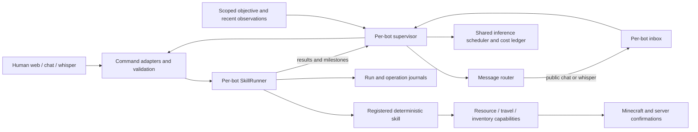

# Agent runtime and supervisors

The foundation is implemented in CommonJS, with deterministic Minecraft skills and one optional larger-model supervisor per bot. The runtime owns physical work; the model can only select registered skills, request a switch, stop its own work, send a peer message, or wait.

The original [Mindcraft comparison](AGENT-ARCHITECTURE-REVIEW.md) explains the findings. The [design baseline](AGENT-ARCHITECTURE-PLAN.md) records the intended architecture. This guide describes the implemented interfaces.

The [source layout](CODE-GUIDE.md#source-layout) maps every responsibility to its folder. `npm run web` starts `src/main.cjs`; HTTP routes live in `src/web/`, and executable skills live in `src/skills/`.

## What is shared, and what belongs to each bot



Each `Agent` owns its connection, runtime, supervisor, objective, inbox, checkpoints, and UI state. Fleet composition shares the peer directory, furnace leases, storage service, API cost ledger, and inference scheduler. The scheduler's default ledger is `data/supervisor-usage.json`, independent of profile order. A standalone `Agent` uses its own data directory for the scheduler ledger.

World labels remain the existing user-selected save identity; use distinct labels for distinct saves. The host remains one Node process. Furnace leases protect bots in that process; they are not distributed locks. Storage continues to use its existing backend leases and reconciliation. Human players can still interfere with a furnace or inventory; confirmation and recovery checks handle observed conflicts.

| Responsibility | Implementation |
| --- | --- |
| Bot identity, default invocation, allowlist, capabilities | `src/agents/profiles.cjs` |
| Fleet composition and shared services | `src/agents/fleet.cjs` |
| Skill registry and canonical parameter/result schemas | `src/skills/registry.cjs`, `src/runtime/skill-contracts.cjs` |
| Structured request validation | `src/runtime/command-service.cjs`, `invocations.cjs`, `schema.cjs` |
| Admission, run receipts, Stop, handoff, cleanup, recovery | `src/runtime/skill-runner.cjs` |
| High-level decision loop and bounded observations | `src/supervisor/supervisor.cjs` |
| Strict model output schema | `src/supervisor/decision-schema.cjs` |
| Shared request/token admission | `src/supervisor/inference-scheduler.cjs` |
| Provider transport and decision response parsing | `src/supervisor/responses-transport.cjs` |
| Neutral resource progression and crop expansion | `src/capabilities/` |
| Atomic versioned stores and private placement compatibility | `src/infra/json-store.cjs`, `src/minecraft/actions.cjs` |
| Peer directory, framed messages, inbox and storage updates | `src/messaging/` |
| Supervisor and run APIs | `src/web/agent-routes.cjs` |
| Supervisor controls | `public/supervisor.js` |

## Using the supervisor

1. Start the controller with `npm run web`, then connect the selected bot to the intended world and dimension.
2. Enter its objective in the Supervisor panel. Choose a model available to your API account. The default is the profile model, then `SUPERVISOR_MODEL`, then `gpt-6-astra`.
3. Select **Shadow** to record decisions without executing them, or **Autonomous** to allow execution.
4. **Save**, then **Resume**. Saving always pauses. Restarting the process always pauses, even if an objective and autonomous mode were previously saved.

`OPENAI_API_KEY` comes only from the server environment. Credentials are excluded from public profiles, snapshots, objectives and request logs. The existing informational `LlmChat` remains separate and shares the provider transport/cost ledger. It cannot start work. Automatic periodic chat summaries remain disabled.

Minecraft chat and whispers support the same skill arguments as web commands:

```text
Forge, start smelt sand 8
Orin, switch to find ores iron within 48
Marc, goal: Grow wheat for the shared base
Marc, supervisor shadow
Marc, supervisor resume
Marc, supervisor pause
Marc, supervisor autonomous
Marc, supervisor resume
Marc, stop
```

Bare `start` selects the last valid invocation or the profile's default. Parameterized defaults are preserved. A skill that needs an area or other unavailable input reports that requirement; it does not invent one.

**Pause** cancels new model decisions. **Stop** also aborts physical work and removes pending switches. Manual skill assignments pause autonomous control. Disconnect, death, teleport, spawn, world/dimension changes and objective changes fence off stale decisions. Pausing or changing an objective also invalidates an already queued autonomous replacement when the old skill reaches its checkpoint.

A running skill does not invoke the model every physics tick. Wakeups come from objectives, peer messages, results, material progress/blockers, idle inventory changes, and an explicit bounded retry selected by the model. Supplies arriving while a bot waits can wake its objective without another chat command. Inventory changes are coalesced to at most one event per 15 seconds and remain observations, not confirmed production effects. Unchanged idle state does not make model calls.

## Budgets and failure behavior

Defaults are two concurrent decisions across the fleet, ten requests per minute, 200 requests per UTC day, and 250,000 tokens per UTC day. Each bot also has a default cap of 40 requests and 100,000 tokens per day, with 2,048 maximum output tokens per decision. Per-bot limits are configurable through the supervisor API; fleet limits are injected when constructing `InferenceScheduler`.

Before sending, the scheduler durably reserves a conservative input/output token allowance. Reported usage replaces that reservation. Unknown usage and crashes retain the reservation. This is request/token admission, not a hard dollar budget; the existing cost dashboard records priced and unknown-cost calls separately. An insufficient allowance blocks inference before sending.

One bot cannot have overlapping inference requests. Pause/timeout returns control promptly, but an abort-ignoring provider retains its scheduler slot until it settles. Refusals, incomplete output, invalid schemas, provider errors, exhausted budgets, and corrupt controller state pause decisions visibly. Existing deterministic work continues unless an independent physical safety condition stops it.

## Profiles and adding bots

The built-in nine profiles remain the default. Set `BOT_PROFILES_FILE` to a JSON array to replace the fleet. For example, `bot-profiles.local.json`:

```json
[
  {
    "id": "forge",
    "username": "Forge",
    "dataDir": "data/forge",
    "defaultInvocation": { "skillId": "smelter", "args": { "item": "sand", "quantity": 8 } },
    "allowedSkills": ["smelter", "goto"],
    "capabilities": [],
    "supervisor": { "model": "gpt-6-astra", "enabled": false }
  }
]
```

IDs, case-insensitive usernames and resolved data directories must be unique. Unknown default skills, invalid arguments and incompatible allowlists fail at startup. Profiles contain preferences; an active skill supplies its operational profession, tools and reserves. Shared storage conservatively keeps the maximum of baseline reserves, current skill supplies and explicit workflow reserves.

`storageCoordinator` authorizes warehouse construction and labels. It is a profile capability, independent of the bot's name. Profile `enabled` is retained as metadata; it never bypasses the explicit supervisor Resume step.

## Requests, results and recovery

The existing `/api/command` endpoint remains available. Structured clients use `POST /bots/:id/api/runs`:

```json
{
  "requestId": "client-request-001",
  "kind": "start",
  "skillId": "smelter",
  "args": { "item": "sand", "quantity": 8 },
  "expectedRunId": null
}
```

`kind` is `start` or `switch`. `expectedRunId` is optional; when supplied, it must match the active run. The adapter supplies provenance; clients cannot declare themselves a supervisor or attach an internal Exchange session. Acceptance returns a receipt, not a completed result. The last 100 request dispositions are retained across restart; reuse of a retained ID with different arguments is rejected. Use fresh IDs for new intentions and inspect an old receipt before retrying.

| Endpoint relative to `/bots/:id` | Purpose |
| --- | --- |
| `GET /api/actions` | All 16 executable contracts, profile permission and live availability |
| `GET /api/runs` | Recent runs, results, interrupted work and recovery requirements |
| `GET /api/requests/:requestId` | Retained acceptance/rejection and associated result |
| `POST /api/runs` | Submit a structured invocation |
| `POST /api/runs/:runId/review` | Human recovery review, with `{ "note": "What was checked..." }` |
| `GET/POST /api/supervisor` | Read/configure mode, model, objective and per-bot budget |
| `POST /api/supervisor/resume` or `/pause` | Explicit control, with an empty JSON object |
| `GET /api/messages` | Inbox, connected peers and queued transport frames |

The runner holds physical ownership until execution and bounded cleanup settle. Ordinary switching requests a separate handoff signal. Checkpoint-capable workflows yield outside inventory transactions; tree work descends and recovers supports, and furnace work saves ownership before yielding. A missed one-minute handoff deadline cancels the proposed replacement and reports `HANDOFF_BLOCKED`; it does not escalate to emergency cancellation.

Results distinguish `succeeded`, `partial`, `blocked`, `cancelled` and `failed`, with reason codes, confirmed effects, outstanding operation IDs, and checkpoint identity. Partial exchange outcomes survive cancellation. A mined block, collected item, furnace output and delivered item are separate effects.

Tree, terraforming and furnace jobs use validated versioned JSON with valid legacy migration. Furnace input/fuel/output transfers, managed chest transfers, managed crafting and exchanges record intent before effects and confirmation afterward. Old iron output or charcoal fuel production cannot satisfy a new glass request. Corrupt saved work is preserved and fails closed.

An interrupted run, unresolved operation, failed checkpoint or failed cleanup blocks new admission in that scope—even a different invocation of the same skill. Inspect the world, inventories and relevant operation/checkpoint records before submitting a human review. A review records what was checked; it does not fabricate completion or resolve an independent backend quarantine. Storage reconciliation and topology changes require explicit human commands. Ordinary Stop/restart of a healthy checkpoint-capable skill still uses its persisted skill job and live validation.

## Peer communication

Public chat and whispers are real Minecraft transport calls. Messages carry identity, scope, correlation IDs, expiry and sender/recipient session fences. Multipart messages are checked for completeness and digest before delivery/ACK. Queues, inboxes, fragments and conversation turns are bounded. Receipt, acceptance and task completion have different meanings; ACKs never wake an LLM.

Peer messages cannot become human controls or replace a human objective. The receiving supervisor decides whether a request helps its objective. Autonomous Exchange is limited to automatic surplus, and the idle recipient must also have a resumed autonomous supervisor and allow Exchange. Explicit gifts/trades retain the human command path. The directory reserves both participants without cancelling a busy or human-assigned peer.

## Verification and rollout

`npm run verify` runs recursive syntax checks, ESLint, checked JSDoc/application input contracts, dependency-boundary and import checks, formatting checks for all source modules, and all behavior tests. The existing physics/confirmation suites remain. Added suites exercise durable intent, cleanup, profile defaults, command parity, stale decisions, strict Responses output, budgets, message framing and a two-bot scenario using real Agent/Runner/Router wiring with fake decisions and simulated skills.

Static types cover the input/schema boundary, not all legacy JavaScript. Skills, adapters, and services are grouped by responsibility; internal imports use the new paths. Neither runtime-generated code nor a wholesale physics rewrite was introduced.

The PostgreSQL integration test uses an explicitly named disposable Docker container (`COLONY_TEST_CONTAINER`); CI provisions one. Local tests skip it when none is configured. Tests require no Minecraft server or paid model calls.

Local verification on September 14, 2026: `npm run verify` passed all static checks and 517 behavior tests, with the one PostgreSQL integration test skipped because Docker was unavailable. The tree physics regression also covers a grounded body whose center is over air: it must walk onto actual support before planning confirmed scaffold placements. CI has been configured but has not been run remotely as part of this task.

For the first live pilot, use a disposable world, one bot with a small allowlist, shadow mode, then autonomous mode with a modest budget. Verify a finite objective, safe switching and Stop during inference. Next repeat a two-bot request, mixed furnace recovery and reconnect. Inspect confirmed results, cost, unnecessary switches and interventions before expanding the fleet. Live Minecraft/model behavior and visual browser rendering have not been validated by the offline test scenarios.
